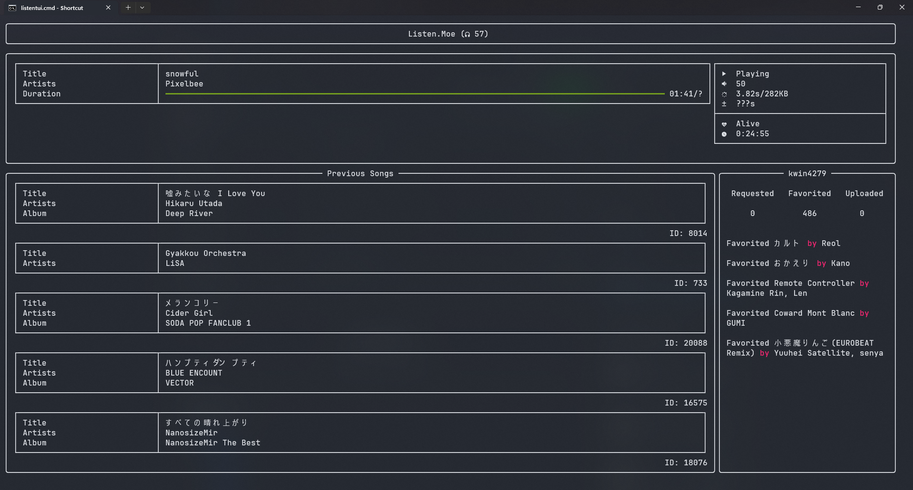

# 
ListenTUI

A listen.moe TUI application

---

# Glossary

- [Installation](#installation)
- [Configuration](#configuration)
    - [System](#system)
    - [Keybind](#keybind)
    - [Display](#display)
    - [Rich Presence](#rich-presence)
    - [Player](#player)
- [Extra](#extra)

---

# Installation
I have not gotten around to learn packaging and distribution so manual for now.
## Requirements

- `MPV`

The program uses mpv to playback audio and as such requires mpv to be installed on your system  
*for windows user you might need to download [libmpv](https://sourceforge.net/projects/mpv-player-windows/files/libmpv/), rename libmpv to mpv-2.dll and add it to $PATH

- `A nerd font`

For the icons, a nerd font font pack is required, get them at [Nerd Font](https://www.nerdfonts.com/)

## How to run
1. Install [poetry](https://python-poetry.org/docs/#installation)
2. clone this directory
3. cd into directory
4. run `poetry shell`
5. run `poetry install`
6. run `poetry run python -m listentui` (can be quite loud on first run)

Additional things:  
- for linux user: you can create a sh file in the same directory with `poetry run python -m listentui` and make a symlink of it into a folder in $PATH so you can call it anywhere in a terminal (from knowledge havent tested)
- for window user: make a shortcut of listentui.cmd

# Configuration
Configuration is done through `config.toml` located in the project directory

#### System
- `username`: username used to log into listen.moe
- `password`: password used to log into listen.moe
- `debug`: log debug info into `logs` folder
- `instance_lock`: limit the running instance to one
#### Keybind
Tip: You can use identifiers such as `${SPACE}`, more at [Windw](https://github.com/magmax/python-readchar/blob/master/readchar/_win_key.py), [Linux](https://github.com/magmax/python-readchar/blob/master/readchar/_posix_key.py)
- `play_pause`: toggle play/pause
- `lower_volume`: lower the volume of the player
- `raise_volume`: raise the volume of the player
- `lower_volume_fine`: lower the volume by 1
- `raise_volume_fine`: raise the volume by 1
- `favourite_song`: favourite the current playing song (only when logged in)
- `restart_player`: restart the player
- `seek_to_end`: seek to the end of the cached (if any) track
#### Display
- `romaji_first`: use romaji (if any) before original
- `separator`: separator between artists
#### Rich Presence
- `enable_rpc`: enable rich presence integration
- `default_placeholder`: placeholder for when text field falls below the two character limit specified by discord
- `use_fallback`: use a fallback image if there isnt one
- `fallback`: the fallback image, has to be a link that discord can access (alternatively, use `fallback2` for listen.moe icon)
- `use_artist`: use the artist image instead if no album image is found
#### Player
- `volume_step`: the volume used by `raise/lower_volume`
- `restart_timeout`: the timeout (secs) to restart the player when there is no playback
- `[player.mpv_options]`: additional options that can be passed into mpv (the default is recommended), see [mvp options](https://mpv.io/manual/master/#options) for more info
# Extra
- `drc`: add `af = "acompressor=ratio=4,loudnorm=I=-16:LRA=11:TP=-1.5"` to mpv_options